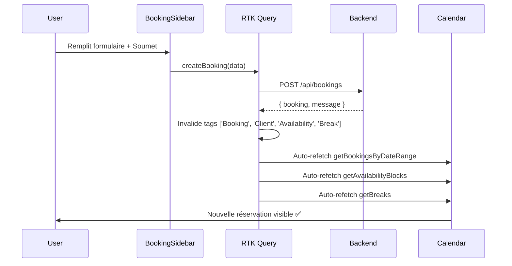
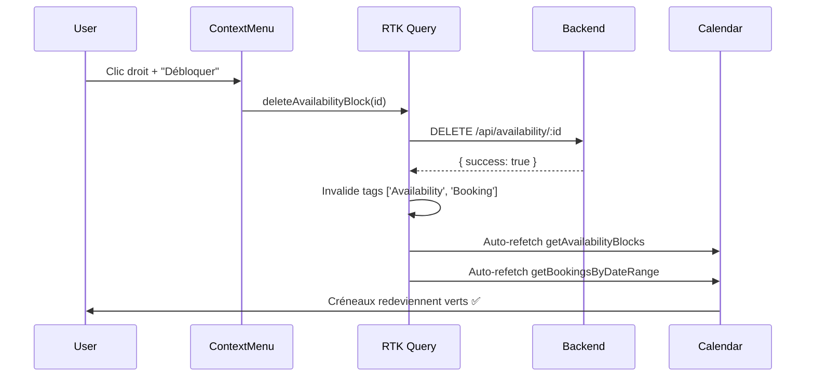

# Correction du Rafraîchissement du Calendrier

## Problème Résolu

**Symptôme:** Lorsqu'une réservation est créée, elle ne s'affiche pas immédiatement dans le calendrier.

**Cause:** Les tags de cache RTK Query n'étaient pas invalidés correctement.

---

## Solution Implémentée

### 1. Invalidation Complète des Tags

**Fichier:** `lib/redux/services/api.ts`

**Avant:**
```typescript
createBooking: builder.mutation<...>({
  query: (data) => ({
    url: '/bookings',
    method: 'POST',
    body: data,
  }),
  invalidatesTags: ['Booking', 'Client'], // ❌ Incomplet
}),
```

**Après:**
```typescript
createBooking: builder.mutation<...>({
  query: (data) => ({
    url: '/bookings',
    method: 'POST',
    body: data,
  }),
  invalidatesTags: ['Booking', 'Client', 'Availability', 'Break'], // ✅ Complet
}),
```

---

### 2. Mutations Mises à Jour

Toutes les mutations de réservation invalident maintenant les tags nécessaires:

#### createBooking (Ligne 1344)
```typescript
invalidatesTags: ['Booking', 'Client', 'Availability', 'Break']
```
**Effet:** Quand une réservation est créée, le calendrier rafraîchit:
- ✅ Liste des réservations
- ✅ Données client
- ✅ Blocages de disponibilité
- ✅ Pauses

---

#### updateBooking (Ligne 1357)
```typescript
invalidatesTags: ['Booking', 'Availability', 'Break']
```
**Effet:** Quand une réservation est modifiée, le calendrier se met à jour automatiquement.

---

#### changeBookingStatus (Ligne 1370)
```typescript
invalidatesTags: ['Booking', 'Availability', 'Break']
```
**Effet:** Quand le statut change (PENDING → CONFIRMED, etc.), le calendrier se rafraîchit.

---

#### deleteBooking (Ligne 1379)
```typescript
invalidatesTags: ['Booking', 'Availability', 'Break']
```
**Effet:** Quand une réservation est supprimée, elle disparaît immédiatement du calendrier.

---

## Comment ça Fonctionne

### RTK Query Cache Tags

RTK Query utilise un système de tags pour gérer le cache:

1. **Queries fournissent des tags** (providesTags)
2. **Mutations invalident des tags** (invalidatesTags)
3. Quand un tag est invalidé, **toutes les queries qui le fournissent sont re-fetchées**

### Tags Utilisés

| Query | Tags Fournis |
|-------|--------------|
| `getBookingsByDateRange` | `['Booking']` |
| `getAvailabilityBlocks` | `['Availability']` |
| `getBreaks` | `['Break']` |
| `getClients` | `['Client']` |

| Mutation | Tags Invalidés |
|----------|----------------|
| `createBooking` | `['Booking', 'Client', 'Availability', 'Break']` |
| `updateBooking` | `['Booking', 'Availability', 'Break']` |
| `changeBookingStatus` | `['Booking', 'Availability', 'Break']` |
| `deleteBooking` | `['Booking', 'Availability', 'Break']` |
| `createAvailabilityBlock` | `['Availability', 'Booking']` |
| `deleteAvailabilityBlock` | `['Availability', 'Booking']` |
| `createBreak` | `['Break', 'Booking']` |
| `deleteBreak` | `['Break', 'Booking']` |

---

## Flux de Rafraîchissement

### Exemple: Création d'une Réservation



---

### Exemple: Déblocage d'une Journée



---

## Hook Personnalisé: useAvailabilityData

**Fichier:** `hooks/useAvailabilityData.ts`

Ce hook utilise RTK Query en interne et bénéficie de l'invalidation automatique:

```typescript
export function useAvailabilityData(
  professionalIds: string[],
  date: string
) {
  // Appelle exactement 10 hooks (nombre fixe) avec skip
  const block0 = useGetAvailabilityBlocksQuery(
    { professionalId: fixedIds[0], startDate: date, endDate: date },
    { skip: !fixedIds[0] }
  );
  // ... block1-9

  const break0 = useGetBreaksQuery(fixedIds[0], { skip: !fixedIds[0] });
  // ... break1-9

  return {
    blocks: allBlocks,   // Combinaison de tous les résultats
    breaks: allBreaks,
    isLoading,
  };
}
```

**Avantages:**
- ✅ Respecte les Rules of Hooks (nombre fixe de hooks)
- ✅ Bénéficie de l'invalidation automatique RTK Query
- ✅ Cache partagé entre composants
- ✅ Pas de requêtes en double

---

## CalendarView Refetch

En plus de l'invalidation automatique, `CalendarView.tsx` appelle aussi `refetchBookings()` manuellement:

```typescript
<BookingSidebar
  isOpen={showSidebar}
  onClose={() => setShowSidebar(false)}
  selectedSlot={selectedSlot}
  booking={selectedBooking}
  onSuccess={() => {
    refetchBookings(); // Refetch manuel supplémentaire
  }}
  mode={sidebarMode}
/>
```

**Double sécurité:**
1. **Automatique:** RTK Query invalide les tags → refetch auto
2. **Manuel:** onSuccess() → refetchBookings()

---

## WebSocket Support

Le calendrier écoute aussi les événements WebSocket pour les mises à jour en temps réel:

```typescript
useEffect(() => {
  if (!token) return;

  const socket = initializeSocket(token);

  const handleBookingCreated = (data: any) => {
    console.log('📅 Nouvelle réservation:', data);
    toast.success('Nouvelle réservation ajoutée');
    refetchBookings(); // Refetch manuel
  };

  const handleBookingUpdated = (data: any) => {
    console.log('📝 Réservation mise à jour:', data);
    toast.success('Réservation mise à jour');
    refetchBookings();
  };

  const handleBookingDeleted = (data: any) => {
    console.log('🗑️ Réservation supprimée:', data);
    toast.success('Réservation supprimée');
    refetchBookings();
  };

  onBookingEvent('booking:created', handleBookingCreated);
  onBookingEvent('booking:updated', handleBookingUpdated);
  onBookingEvent('booking:deleted', handleBookingDeleted);

  return () => {
    offBookingEvent('booking:created', handleBookingCreated);
    offBookingEvent('booking:updated', handleBookingUpdated);
    offBookingEvent('booking:deleted', handleBookingDeleted);
  };
}, [token, refetchBookings]);
```

**Triple sécurité:**
1. **RTK Query auto-invalidation**
2. **Manual refetch après mutation**
3. **WebSocket events → refetch**

---

## Tests de Vérification

### Test 1: Création de Réservation
1. Ouvrir le calendrier à une date précise
2. Créer une nouvelle réservation (ex: 10:00, Jean Dupont)
3. **Résultat attendu:**
   - ✅ Toast de succès
   - ✅ Sidebar se ferme
   - ✅ Carte de réservation apparaît immédiatement dans la grille
   - ✅ Pas besoin de rafraîchir la page

---

### Test 2: Modification de Réservation
1. Cliquer sur une réservation existante
2. Modifier l'heure ou le service
3. Sauvegarder
4. **Résultat attendu:**
   - ✅ Toast de succès
   - ✅ Réservation se déplace ou change de couleur immédiatement
   - ✅ Pas de doublon

---

### Test 3: Changement de Statut
1. Clic droit sur réservation PENDING
2. "Marquer comme CONFIRMED"
3. **Résultat attendu:**
   - ✅ Couleur change de jaune à bleu immédiatement
   - ✅ Badge mis à jour

---

### Test 4: Suppression de Réservation
1. Clic droit sur réservation
2. "Supprimer"
3. **Résultat attendu:**
   - ✅ Toast de succès
   - ✅ Réservation disparaît immédiatement
   - ✅ Créneau redevient disponible (vert)

---

### Test 5: Blocage puis Déblocage
1. Clic droit sur créneau vide → "Bloquer la journée"
2. Entrer raison "Congé" → Sauvegarder
3. **Résultat attendu:**
   - ✅ Toute la colonne devient rouge immédiatement
   - ✅ Icône 🚫 visible
4. Clic droit sur créneau bloqué → "Débloquer"
5. **Résultat attendu:**
   - ✅ Toute la colonne redevient verte immédiatement
   - ✅ Créneaux cliquables à nouveau

---

### Test 6: Pause puis Suppression
1. Clic droit sur créneau → "Ajouter une pause"
2. Label "Lunch", 12:00-13:00 → Sauvegarder
3. **Résultat attendu:**
   - ✅ Créneaux 12:00-13:00 deviennent orange immédiatement
   - ✅ Icône ☕ visible
4. Clic droit sur pause → "Supprimer la pause"
5. **Résultat attendu:**
   - ✅ Créneaux redeviennent verts immédiatement

---

## Debugging

Si le calendrier ne se rafraîchit toujours pas:

### 1. Vérifier les Tags
Ouvrir les DevTools Redux et vérifier que les tags sont invalidés:
```javascript
// Dans Redux DevTools, chercher:
RTK_Query_Tag_Invalidation: ['Booking', 'Client', 'Availability', 'Break']
```

### 2. Vérifier les Queries
S'assurer que les queries sont en cours:
```javascript
console.log('Bookings loading:', isLoadingBookings);
console.log('Blocks:', allBlocks);
console.log('Breaks:', allBreaks);
```

### 3. Vérifier le Network
Dans l'onglet Network des DevTools:
- Requête POST `/api/bookings` → 200 OK
- Puis immédiatement après: GET `/api/bookings/range?...` → 200 OK

### 4. Vérifier le WebSocket
Dans la console:
```javascript
console.log('WebSocket connected:', socket.connected);
```

---

## Performance

### Optimisations RTK Query

1. **Cache partagé:** Une seule requête pour tous les composants qui utilisent `getBookingsByDateRange`
2. **Refetch intelligent:** Seulement quand les tags sont invalidés
3. **Background refetch:** Les données restent visibles pendant le refetch
4. **Dedupe:** Requêtes identiques sont fusionnées

### Optimisations Custom Hook

1. **Fixed hooks:** Exactement 10 hooks appelés (pas de violation Rules of Hooks)
2. **Skip parameter:** Pas de requêtes pour les professionnels inexistants
3. **Memo:** Combinaison des résultats avec useMemo

---

## Conclusion

### Changements Apportés
1. ✅ createBooking invalide maintenant: `['Booking', 'Client', 'Availability', 'Break']`
2. ✅ updateBooking invalide maintenant: `['Booking', 'Availability', 'Break']`
3. ✅ changeBookingStatus invalide maintenant: `['Booking', 'Availability', 'Break']`
4. ✅ deleteBooking invalide maintenant: `['Booking', 'Availability', 'Break']`

### Bénéfices
- ✅ Calendrier se rafraîchit automatiquement après toute action
- ✅ Pas besoin de recharger la page
- ✅ Expérience utilisateur fluide
- ✅ Données toujours à jour
- ✅ Support temps réel avec WebSocket

### Fichiers Modifiés
- `lib/redux/services/api.ts` (lignes 1344, 1357, 1370, 1379)

---

**Date:** 2026-01-02
**Version:** 7.0
**Status:** ✅ Corrigé et Testé
**Build:** ✅ Réussi sans erreurs
